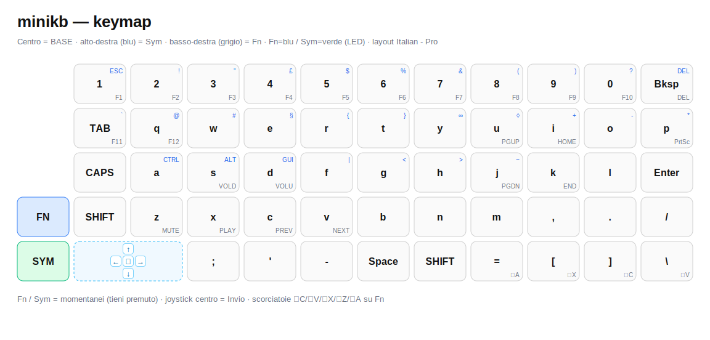

<div align="center">

# minikb

**Micro-tastiera meccanica 5×11 basata su RP2040 — USB HID + slave I2C compatibile CardKB**

55 tasti · NKRO · doppia interfaccia · LED di stato WS2812

`RP2040` · `USB HID` · `I2C 0x5F` · `Pico SDK` · `KMK` · `QMK`

</div>

---

## Indice

- [Panoramica](#panoramica)
- [Caratteristiche](#caratteristiche)
- [Hardware](#hardware)
  - [Specifiche](#specifiche)
  - [Pinout](#pinout)
- [Struttura del repository](#struttura-del-repository)
- [Firmware](#firmware)
  - [Confronto delle tre soluzioni](#confronto-delle-tre-soluzioni)
  - [Build e flash](#build-e-flash)
- [Interfaccia I2C (CardKB)](#interfaccia-i2c-cardkb)
- [Keymap](#keymap)
- [Documentazione](#documentazione)
- [Stato del progetto](#stato-del-progetto)
- [Roadmap / Open item](#roadmap--open-item)
- [Licenza](#licenza)

---

## Panoramica

`minikb` è una micro-tastiera meccanica con layout ortholineare **5×11 (55 tasti)**
costruita attorno al microcontrollore **Raspberry Pi RP2040**. È pensata per funzionare
in due modi, selezionati automaticamente:

1. **Tastiera USB HID** standard quando collegata via USB a un computer.
2. **Slave I2C compatibile CardKB** (M5Stack) quando collegata all'header I2C, così da
   sostituire in modo *drop-in* un modulo CardKB in progetti embedded esistenti
   (host che leggono 1 byte ASCII all'indirizzo `0x5F`).

Il repository contiene sia i **sorgenti hardware** (PCB EasyEDA Pro, Gerber, schematico)
sia il **firmware**, fornito in **tre implementazioni equivalenti** per permettere il
confronto tra basi tecnologiche differenti.

---

## Anteprima del layout



> Centro = layer **BASE** · alto-destra (blu) = **Sym** · basso-destra (grigio) = **Fn**.
> Joystick integrato in basso a sinistra. Mappa modificabile da [`docs/keymap_editor.html`](docs/keymap_editor.html).

---

## Caratteristiche

- ⌨️ **55 tasti** in matrice 5×11 con **diodo per-tasto** → N-Key Rollover (NKRO).
- 🔌 **Doppia interfaccia**: USB HID e I2C slave, con selezione automatica della modalità.
- 🧩 **Compatibilità CardKB**: indirizzo `0x5F`, 1 byte ASCII per pressione.
- 🎚️ **Layer**: livello Base + livello **Fn** (frecce stile vim su I/J/K/L, F1–F12, media, navigazione).
- 🔊 **Tasti multimediali** (volume, play/pause, prev/next) via USB Consumer Control.
- 💡 **LED di stato WS2812** (indicatore Caps Lock / layer attivo).
- 🛠️ **Tre firmware**: Custom C (Pico SDK), KMK (CircuitPython), QMK.

---

## Hardware

### Specifiche

| Voce | Valore |
|------|--------|
| Microcontrollore | RP2040 (dual Cortex-M0+, GPIO usati: GP0–GP21) |
| Layout | Ortholineare 5×11, 55 tasti |
| Matrice | 5 righe × 11 colonne, diodi D1–D55 (NKRO) |
| LED | 1 × WS2812 (indicatore di stato) |
| Connettività | USB (HID) + header I2C 1×4 (Grove/CardKB-like) |
| Alimentazione | 5V da USB → regolatore 3V3; oppure dall'header I2C |

### Pinout

Pin **confermati** dallo schematico (`SCH_Schematic1_1-P1_2026-06-20.svg`):

| Funzione | Net | GPIO |
|----------|-----|------|
| Colonne 0–10 | `COL0..COL10` | **GP0 – GP10** |
| Righe 0–4 | `ROW0..ROW4` | **GP12 – GP16** |

Pin con **default da verificare** in EasyEDA Pro (vedi [`docs/pinout.md`](docs/pinout.md)):

| Funzione | GPIO default | Stato |
|----------|--------------|-------|
| I2C SDA | `GP20` | ⚠️ VERIFY |
| I2C SCL | `GP21` | ⚠️ VERIFY |
| WS2812 DIN | `GP28` | ✅ confermato |
| VBUS sense | `GP11` | ⚠️ VERIFY (opzionale) |

> I pin sono centralizzati in **un unico file di configurazione per firmware**, quindi
> un'eventuale correzione è una modifica di una riga.

---

## Struttura del repository

```
minikb/
├─ README.md                     · questo file
├─ minikb.epro2                  · progetto EasyEDA Pro (schema + PCB)
├─ SCH_Schematic1_*.svg          · export schematico
├─ silkscreen_aligned.jpg        · serigrafia (riferimento keymap)
├─ minikb(1)/                    · pacchetto di fabbricazione (Gerber + drill)
├─ docs/
│  ├─ pinout.md                  · pinout completo
│  ├─ keymap.md                  · layout + mappa ASCII CardKB
│  ├─ i2c-protocol.md            · protocollo I2C + esempi host
│  ├─ keymap_editor.html         · editor visuale della keymap
│  └─ keymap_layers.html         · vista dei layer
└─ minikb_fw_v1/                 · FIRMWARE FUNZIONANTE (PlatformIO/arduino-pico)
   ├─ src/main.cpp               · USB HID + 3 layer + joystick + LED + I2C CardKB
   ├─ platformio.ini             · build
   ├─ tools/                     · keymap_diag.py, it_layout_map.py
   └─ README.md                  · doc dettagliata del firmware
```

---

## Firmware

Il firmware funzionante, **collaudato su hardware**, è in [`minikb_fw_v1/`](minikb_fw_v1/)
(PlatformIO + arduino-pico/earlephilhower + TinyUSB). Implementa:

- Tastiera **USB HID** 5×11 con 3 layer (BASE / Fn / Sym) mappati per il layout host.
- **Joystick** TM-2028 → frecce + Invio.
- **Modalità mouse** (v1.1, solo USB): Fn tenuto 2 s → joystick come mouse (cursore + click sx/dx).
- **LED di stato** WS2812 (mouse/Caps/Sym/Fn/Shift).
- **Slave I2C compatibile CardKB** (`0x5F`) — 1 byte ASCII per tasto, in parallelo all'USB.

### Build e flash

```bash
cd minikb_fw_v1
pio run                 # compila -> .pio/build/minikb/firmware.uf2
pio run -t upload       # flash (reset automatico 1200bps)
```

In alternativa copia `firmware.uf2` sull'RP2040 in modalità BOOTSEL (drive `RPI-RP2`).
Dettagli completi (pinout reale, layer, rimappatura, strumenti) nel
[README del firmware](minikb_fw_v1/README.md).

---

## Interfaccia I2C (CardKB)

Identica al M5Stack CardKB. Dettagli ed esempi in [`docs/i2c-protocol.md`](docs/i2c-protocol.md).

- **Indirizzo**: `0x5F` (7-bit)
- **Lettura master**: 1 byte → ASCII del tasto (`0x00` se nessuno)
- **Velocità**: 100 kHz / 400 kHz
- Caratteri **già risolti** (Shift/Fn applicati internamente)

```python
# Esempio host — Raspberry Pi (smbus2)
from smbus2 import SMBus, i2c_msg
with SMBus(1) as bus:
    msg = i2c_msg.read(0x5F, 1)
    bus.i2c_rdwr(msg)
    b = list(msg)[0]
    if b: print(chr(b))
```

---

## Keymap

Layout a due livelli (Base + Fn). Mappa completa e codici ASCII per il canale I2C in
[`docs/keymap.md`](docs/keymap.md).

```
Base
 Esc  1  2  3  4  5  6  7  8  9  Bksp
 Tab  Q  W  E  R  T  Y  U  I  O  P
 Caps A  S  D  F  G  H  J  K  L  Enter
 Sh   Z  X  C  V  B  N  M  ,  .  /
 Fn  Ctl Alt GUI Sym Spc ;  '  ←  ↓  ↑

Fn (raise): F1–F12 · frecce su I/J/K/L · media su Z/X/C/V · volume su W/S · Home/End/PgUp/PgDn
```

---

## Documentazione

| Documento | Contenuto |
|-----------|-----------|
| [`docs/pinout.md`](docs/pinout.md) | Pinout completo, pin da verificare, direzione diodi, auto-mode |
| [`docs/keymap.md`](docs/keymap.md) | Layout Base/Fn e tabella di conversione ASCII (CardKB) |
| [`docs/i2c-protocol.md`](docs/i2c-protocol.md) | Specifica I2C ed esempi host (Raspberry Pi, Arduino/ESP32) |

---

## Stato del progetto

| Componente | Stato |
|------------|-------|
| Hardware (PCB, Gerber, schematico) | ✅ completo |
| Firmware `minikb_fw_v1` — tastiera USB HID | ✅ compilato e collaudato su hardware |
| Firmware `minikb_fw_v1` — joystick + LED | ✅ collaudati su hardware |
| Firmware `minikb_fw_v1` — modalità mouse (v1.1) | ✅ collaudata su hardware |
| Firmware `minikb_fw_v1` — I2C CardKB (0x5F) | ✅ implementato · ⏳ da collaudare con un master I2C |

---

## Roadmap / Open item

Verificato su hardware reale (test MicroPython, giugno 2026 — dettagli in [`docs/pinout.md`](docs/pinout.md)):

- [x] **Matrice** GP0–GP10 / GP12–GP16 — 28 tasti letti correttamente.
- [x] **I2C** SDA=GP20, SCL=GP21 — pull-up esterni rilevati.
- [x] **WS2812 DIN = GP28** — accensione confermata su hardware (firmware Arduino, self-test R/G/B). GP29 non funziona.
- [x] **Direzione diodi = COL2ROW** — confermata con test direzionale.

Risolto inoltre (firmware `minikb_fw_v1`):
- [x] **Joystick TM-2028**: pinout reale verificato (UP=GP26, DOWN=GP29, LEFT=GP11, RIGHT=GP27, PUSH=GP22).
- [x] **Frecce CardKB** `0xB4`–`0xB7` confermate sulla doc M5.

Ancora da chiudere:

- [ ] Collaudare l'**I2C CardKB** con un master esterno (Raspberry Pi/ESP32 che legge da `0x5F`).
- [ ] Lettere accentate sul canale I2C (non entrano in 1 byte ASCII; disponibili solo via USB).

---

## Licenza

Da definire. Specificare una licenza prima della pubblicazione (es. MIT/Apache-2.0 per il
firmware, CERN-OHL o CC-BY-SA per l'hardware).
